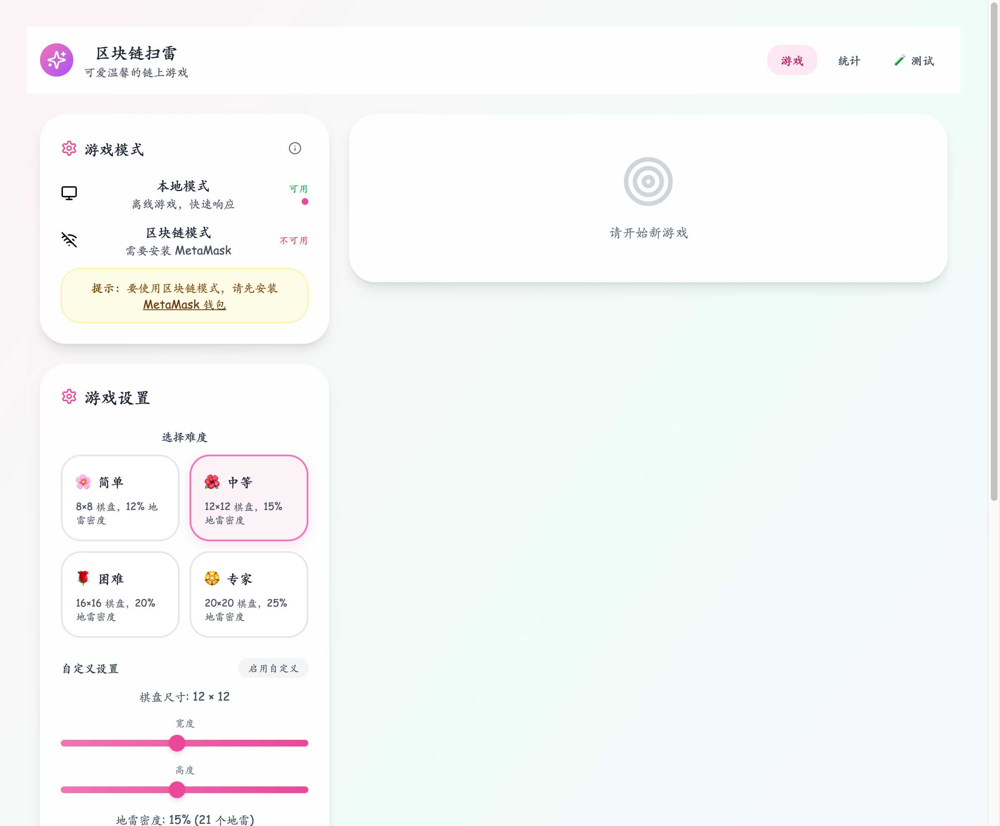
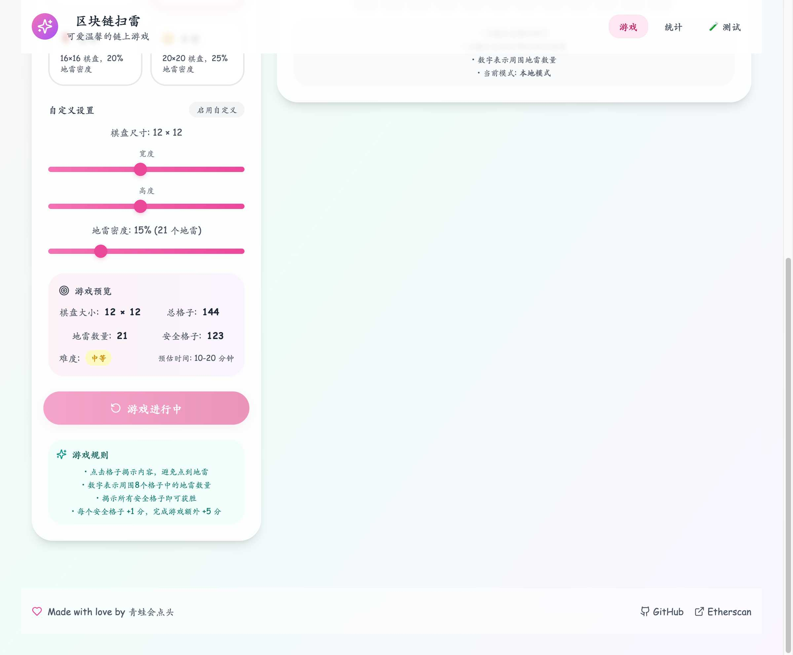
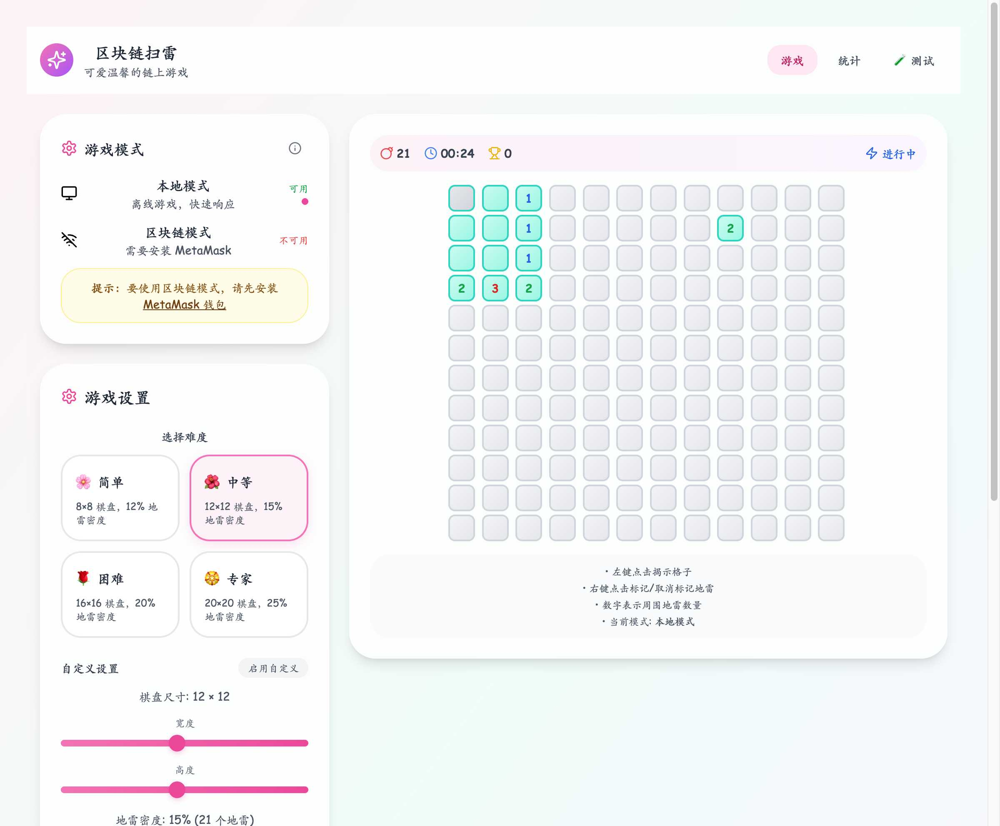
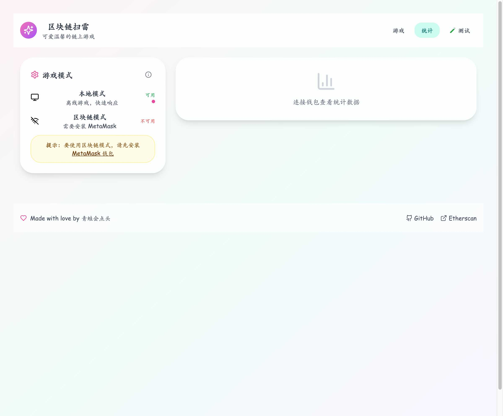
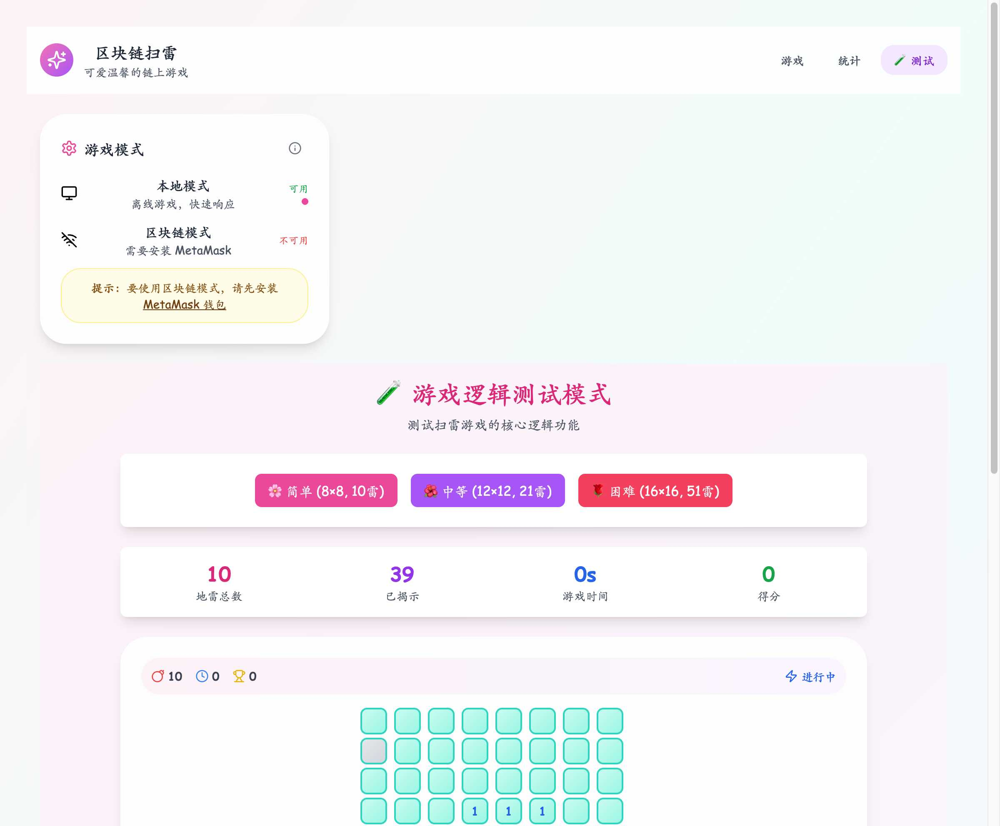

# 🌸 区块链扫雷游戏 (Blockchain Minesweeper)

一个可爱温馨的区块链扫雷游戏，采用 Solidity 智能合约和 React 前端开发。

## ✨ 特性

- 🎮 完整的链上扫雷游戏逻辑
- 💖 可爱温馨的用户界面设计
- 🏆 永久存储的积分系统
- 🔧 自定义棋盘大小和地雷数量
- 🔐 安全的智能合约实现
- 📱 响应式设计，支持桌面和移动端

## 🖼️ 功能预览

### 🎮 游戏设置界面


_可爱温馨的游戏设置界面，支持多种难度选择和自定义设置_

### 🎯 游戏棋盘


_12×12 扫雷棋盘，展示可爱的视觉设计和游戏状态_

### 🎲 游戏进行中


_游戏进行中的状态，显示数字提示和已揭示的格子_

### 📊 统计界面


_玩家统计数据界面，支持区块链模式下的数据查看_

### 🧪 测试模式


_独立的测试模式，用于验证游戏逻辑和功能_

## 🏗️ 项目结构

```
blockchain-minesweeper/
├── contracts/          # 智能合约
│   ├── contracts/      # Solidity 合约文件
│   ├── scripts/        # 部署脚本
│   ├── test/          # 合约测试
│   └── hardhat.config.js
├── frontend/          # React 前端应用
│   ├── src/
│   ├── public/
│   └── package.json
└── README.md
```

## 🚀 快速开始

### 环境要求

- Node.js >= 16.0.0
- npm 或 yarn
- MetaMask 钱包

### 安装依赖

```bash
# 安装所有依赖
npm run install:all
```

### 开发模式

```bash
# 启动本地区块链节点
npm run node

# 编译智能合约
npm run compile

# 运行测试
npm run test

# 启动前端开发服务器
npm run dev
```

### 部署到测试网

```bash
# 部署到 Sepolia 测试网
npm run deploy:sepolia
```

## 🎯 游戏规则

1. 选择棋盘大小（5x5 到 20x20）和地雷数量
2. 点击格子揭示内容
3. 数字表示周围地雷数量
4. 避免点击地雷
5. 揭示所有安全格子即获胜

## 🏆 积分系统

- 揭示安全格子：+1 分
- 完成游戏：额外 +5 分
- 难度加成：根据地雷密度提供倍率

## 🔧 技术栈

- **智能合约**: Solidity + Hardhat
- **前端**: React + Vite + Tailwind CSS
- **Web3**: Ethers.js
- **测试网**: Sepolia

## 📝 许可证

MIT License
